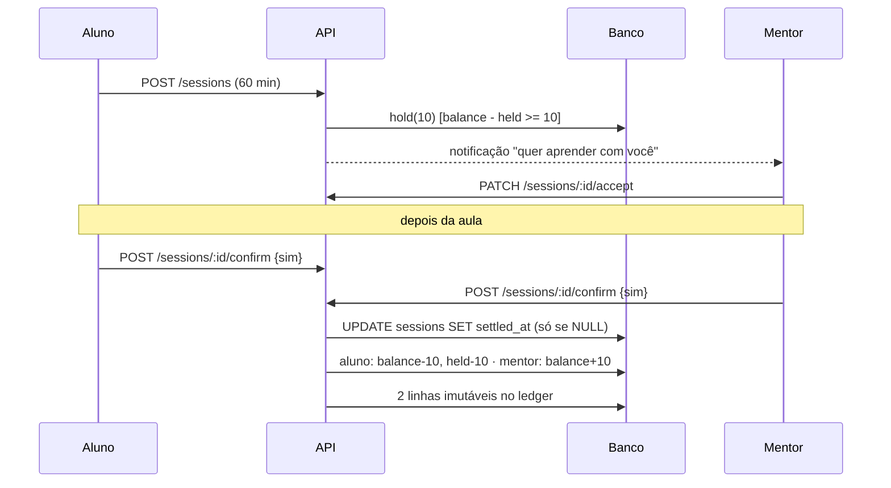
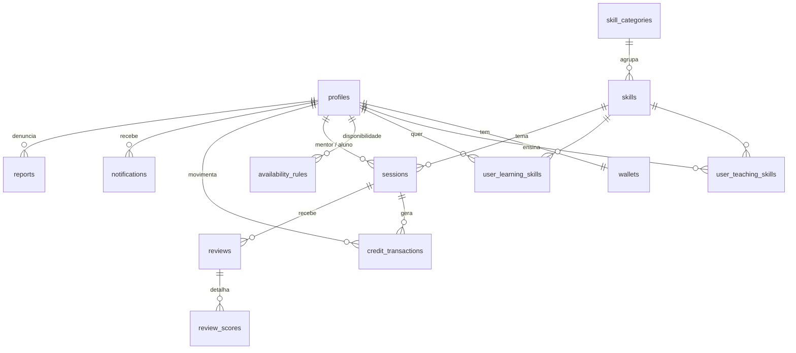

# Arquitetura

## Visão geral

```
Navegador (React SPA, Cloudflare Pages)
   │  cadastro / login / recuperação ───────► Supabase Auth ──► emite o JWT
   │  upload da foto (URL assinada) ────────► Supabase Storage
   │  Authorization: Bearer <JWT>
   ▼
API NestJS (Render)
   Guards: rate limit → autenticação (JWT) → papel
   Controller ──► Service ──► Repository (Prisma) ──► Supabase PostgreSQL
                     │
                     └─ regras de negócio: aulas, créditos (ledger), match, avaliações
```

Princípios:

- **Uma API, sem microserviços.** O front só fala diretamente com o Supabase para autenticar e enviar a
  foto; todo o resto passa pela API, que é a dona das regras.
- **O banco também protege.** Constraints de exclusão, CHECKs, triggers e RLS reforçam o que o backend valida.
- **Segredos só no servidor.** A `service role key` nunca vai ao navegador.
- **Falha cedo.** As variáveis de ambiente são validadas com Zod na subida da API.

## Monorepo (pnpm workspaces)

```
know-know/
├─ apps/
│  ├─ api/        NestJS + Prisma (porta 3000)
│  └─ web/        React + Vite + Tailwind
├─ packages/
│  └─ shared/     enums, schemas Zod e contratos usados pelos dois lados
├─ docs/
└─ .github/workflows/ci.yml
```

`shared` é compilado em duas saídas (ESM para o Vite, CommonJS para o Nest) e não depende de `web` nem de `api`.

## Backend (`apps/api/src`)

Cada módulo de domínio segue **Controller → Service → Repository/Prisma → Banco**. Controllers só
recebem, validam (Zod) e devolvem; as regras ficam nos services.

| Módulo                                    | Responsabilidade                                                                    |
| ----------------------------------------- | ----------------------------------------------------------------------------------- |
| `auth`                                    | Valida o JWT do Supabase (JWKS ou HS256 com algoritmos fixos), guard global, papéis |
| `profiles`, `users`                       | Perfil próprio (`/me`), perfil público, onboarding, avatar, exclusão de conta       |
| `skills`, `teaching`, `learning`          | Catálogo e as listas "ensino" / "quero aprender"                                    |
| `availability`                            | Horários semanais por fuso e cálculo de horários livres                             |
| `explore`, `matching`                     | Busca com filtros e pontuação de compatibilidade (função pura)                      |
| `sessions`                                | Máquina de estados da aula, contraproposta, confirmação dupla, expiração            |
| `credits`, `wallet`                       | **Ledger**, reserva (escrow), liquidação; leitura de saldo e histórico              |
| `reviews`                                 | Avaliações e reputação materializada                                                |
| `notifications`                           | Notificações dentro do app (e lembretes sob demanda)                                |
| `reports`, `admin`                        | Denúncias e painel administrativo                                                   |
| `dashboard`, `platform`, `health`         | Resumo do painel, `GET /config`, `GET /health`                                      |
| `common`, `config`, `database`, `storage` | Filtro de erros, validação de ambiente, Prisma, Supabase Storage                    |

Pontos de atenção:

- **Erros padronizados**: `{ "error": { "code", "message", "details?" } }`. Erros do Prisma nunca vazam.
- **Transações e travas**: cada mudança de estado de uma aula abre uma transação e faz
  `SELECT … FOR UPDATE` na linha, o que serializa ações concorrentes.
- **Sem jobs agendados**: o plano gratuito dorme. A expiração de pedidos vencidos e os lembretes
  acontecem "sob demanda", quando a pessoa consulta suas aulas, carteira ou notificações.

## Frontend (`apps/web/src`)

```
app/         providers, roteador (code splitting por rota), layouts (público e app)
components/  ui/ (Button, Modal, FormField…), brand/, seo/
features/    auth, onboarding, profile, skills, availability, explore, sessions,
             wallet, reviews, notifications, dashboard, settings, static, admin
lib/         cliente HTTP, Supabase, formatação, datas, labels
styles/      tokens.css (design tokens derivados da logo) + Tailwind
```

- **TanStack Query** cuida de tudo o que vem da API; não há estado global duplicado. Depois de cada
  ação sobre uma aula, listas, painel, saldo e notificações são revalidados.
- **React Hook Form + Zod** nos formulários; o servidor valida de novo.
- **Toda tela que busca dados** trata loading, erro, vazio e sucesso.

## Fluxo de autenticação

1. O navegador autentica no Supabase Auth e recebe um JWT.
2. Cada chamada à API leva `Authorization: Bearer <JWT>`.
3. `AuthGuard` verifica assinatura, emissor, audiência e expiração. O algoritmo aceito é fixo por tipo
   de chave (proteção contra "alg: none" e confusão de algoritmo).
4. Na **primeira** chamada, a API cria o perfil, a carteira e o bônus de boas-vindas **em uma transação**
   (seguro contra requisições simultâneas).
5. Papel e status vêm **do banco**, nunca do token: suspender uma conta vale imediatamente.

## Fluxo de créditos



## Modelo de dados



Decisões de modelagem:

- `profiles.id` é o `auth.users.id` do Supabase. E-mail e senha ficam só lá.
- Sem tabela `session_participants`: `mentor_id` e `student_id` bastam e permitem o CHECK de "não consigo mesmo".
- A reputação (`mentor_rating_*`, `student_rating_*`) é **materializada** e atualizada na transação da
  avaliação: o Explorar não agrega nada por card (sem N+1).
- Nada de JSON para dados relacionais. Soft delete só em perfis (anonimização).
- Regras que o Prisma não expressa estão em `prisma/migrations/*_database_rules/migration.sql`.

## Decisões e limites conhecidos

| Decisão                                                                                           | Motivo                                                                    | Limite / evolução                                         |
| ------------------------------------------------------------------------------------------------- | ------------------------------------------------------------------------- | --------------------------------------------------------- |
| Pontuação do match calculada em memória sobre até 300 candidatos                                  | Precisa dos dois perfis; simples de explicar e testar                     | Para escalar, mover pré-filtro e ordenação para SQL       |
| Rate limit em memória (por instância)                                                             | Suficiente para uma instância no MVP                                      | Com várias instâncias, usar storage compartilhado (Redis) |
| Estados `IN_PROGRESS`/`AWAITING_CONFIRMATION` derivados do relógio                                | Sem cron no plano gratuito                                                | Um job agendado deixaria a expiração proativa             |
| Disputas resolvidas manualmente pelo admin                                                        | Arbitragem complexa está fora do MVP                                      | Regras automáticas e prazo de resposta                    |
| Avatar antigo não é apagado ao trocar a foto                                                      | Simplicidade                                                              | Rotina de limpeza no Storage                              |
| Prisma 7 emite um aviso do `pg` ("client.query() com consulta em andamento") dentro de transações | Comportamento interno do interpretador de consultas do Prisma; é só aviso | Acompanhar atualizações do Prisma/`pg`                    |
